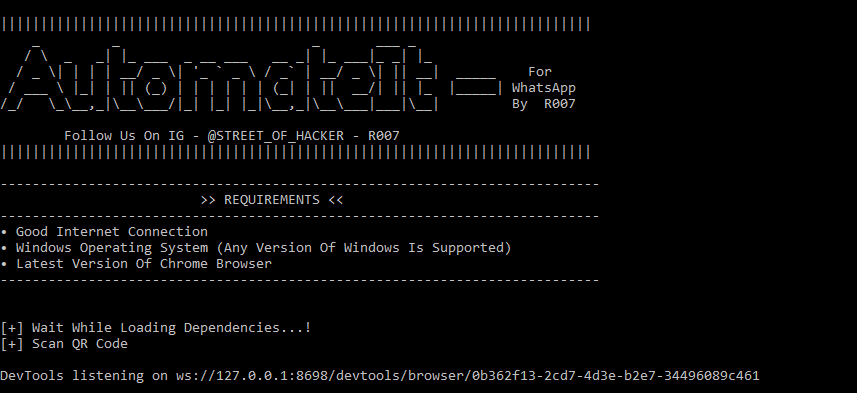

# AutomateIT-Version-win1.0
AutomateIT For Whatsapp is a python3 based tool that can be used to automatically send messages on Whatsapp.

As we all know Whatsapp do not allow us to forward messages more than 5 peoples at a time. If one want to send same message to more than 30 to 40 peoples or groups than it will eat up his/her more time.

AutomateIT for Whatsapp tool is created to save your lot of time.

# Supported Plateforms :
• For Now only windows OS is supported by AutomateIT but if future we will try to make it flexible for all major Operating Systems like Linux, MAC OS and Android as well.

# Requirements :
• Good Internet Connection.

• Python Any Version Supported (Preffered Python version 3.7.2).

• Windows Operating System (Any Version Of Windows Is Supported).

• Latest Version Of Chrome Browser.

# Installation :
• Paste this URL in your browser : https://github.com/StreetOfHackerR007/AutomateIT-Version-win1.0/archive/master.zip and wait while AutomateIt for WhatsApp is downloading.

• Go to your downloads folder. copy AutomateIT-Version-win1.0.zip file and paste it wherever you want to store it in your hard disk.

• Right click on that file and click on extract files here.

• Open your cmd and type command "pip install selenium" without quotes.

• All Done.

# How To Use :
• After extracting file you must get one folder with name "AutomateIT Version win1.0" open that folder.

• There will be a file of name "AutomateIT.py" double click on that file. (Make sure you have installed selenium module)

• After a while you will get cmd and Google Chrome windows open in your desktop screen

• Take your phone > Open WhatsApp application > Tap on three dots on top right corner > click on WhatsApp Web

• Scan QR code appearing on chrome browser using your phone

• Come back to cmd window and press enter button

• It will open user.txt file Enter the person's name or group name whom you want to send a message each name must be in new line > After entering all person's name save and close that file

• After that message.txt file will be open type your message there > After that save and close that file

• Come back to cmd window and press enter and have a cup of coffee.

• Because your laptop will do your rest of work for you. if anything went wrong it will show warning or error regarding that issue.

• After sending messge to all persons/groups it will show u successfull and unsuccessfull attempts on cmd screen and ask you to send new message

• THAT'S ALL...!

# JOIN US
Telegram  : https://t.me/StreetOfHackerR007/   &
            https://t.me/realworldhacker/

Instagram : https://instagram.com/street_of_hacker/

YouTube   : https://www.youtube.com/channel/UCArR9Q_67QfnzGai6pkU6yQ or @STREET_OF_HACKER - R007

Our Website : https://streetofhacker007.blogspot.com/

Twitter   : https://twitter.com/streetofhacker

# Video Tutorial - How To Use AutomateIT For WhatsApp

